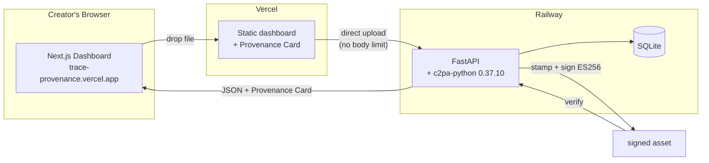

# Trace

> Provenance for AI-generated creator content.

[](https://github.com/sodiq-code/trace/actions/workflows/ci.yml)
[](https://www.python.org/downloads/)
[](LICENSE)

**Live demo:** https://trace-provenance.vercel.app · **Demo video:** https://youtu.be/pvT07bj1nak

---

## Thesis

> EU AI Act Article 50 transparency obligations take effect on 2 August 2026. For teams trying to operationalize provenance at scale, manual legal and compliance workflows can become expensive. Trace turns the resulting provenance requirement into a sub-second library call — provenance is a workflow, not a feature.

---

## What Trace does

Trace attaches **cryptographically-verifiable C2PA provenance manifests** to AI-generated assets — images, audio, video — in under one second. Every stamped asset gets:

- An **ES256-signed C2PA manifest** embedded directly in the file (not a sidecar)
- A **public Provenance Card URL** rendering the full source chain in plain English
- A **verification API** any platform, sponsor, or reviewer can call

The manifest records: which AI model generated the asset, the prompt used, the creator's identity, and a tamper-evident signature. Any modification to the file after stamping invalidates the manifest.

## Why it matters

As the EU AI Act's Article 50 transparency obligations take effect on 2 August 2026, AI-generated and manipulated content increasingly needs machine-readable provenance and disclosure workflows. For teams trying to operationalize provenance at scale, manual legal and compliance workflows can become expensive and difficult to maintain.

Trace makes provenance a **sub-second workflow step** instead of a costly post-production bolt-on.

## How it works

1. **Stamper** wraps [`c2pa-python 0.37.10`](https://github.com/contentauth/c2pa-python) (the official C2PA consortium Python bindings, wrapping the Rust SDK 0.90.19). It builds a C2PA V2 manifest with `c2pa.actions` (`digitalSourceType = trainedAlgorithmicMedia`) plus `std.trace.creator`, `std.trace.model`, and `std.trace.prompt` assertions, signs with ES256, and embeds it in the asset.
2. **SQLite** records every stamp for the compliance dashboard and monthly report.
3. **Verifier** reads the manifest back and confirms `claimSignature.validated`, `timeStamp.validated`, and `assertion.hashedURI.match` — the green-path guarantee.



The browser uploads directly to Railway, bypassing Vercel's serverless body-size limit. Files up to 100 MB are supported.

## Try it in 60 seconds

```bash
git clone https://github.com/sodiq-code/trace.git
cd trace
make setup && make dev

trace stamp your-image.png \
  --model midjourney-v7 \
  --prompt "neon tech thumbnail" \
  --creator you@channel.com
```

Or try the live demo: https://trace-provenance.vercel.app — drop any file, pick a model, click Stamp.

## CLI

| Command | Description |
| --- | --- |
| `trace init --email X --channel Y` | Provision signing keys + creator identity |
| `trace stamp <file> [--model --prompt --creator]` | Attach a C2PA manifest |
| `trace stamp-dir <dir>` | Batch-stamp a folder |
| `trace verify <file> [--json]` | Verify a stamped asset's signature |
| `trace list [--limit N]` | List recently stamped assets |
| `trace serve [--host --port]` | Start the HTTP API |
| `trace report` | Generate a compliance report PDF |

## API

| Endpoint | Description |
| --- | --- |
| `POST /v1/stamp` | Stamp an uploaded asset (multipart) |
| `GET /v1/verify/<asset_id>` | Claim chain + signature validity |
| `GET /v1/manifest/<asset_id>` | Raw C2PA manifest JSON |
| `GET /v1/assets` | Recent assets list |
| `GET /v1/stats` | Dashboard stats |
| `GET /v1/report` | Compliance report PDF |
| `GET /card/<asset_id>` | Provenance Card redirect |
| `GET /healthz` | Liveness probe |
| `GET /docs` | OpenAPI documentation |

## Architecture

- **Backend:** Railway (Python 3.12, FastAPI, c2pa-python 0.37.10, SQLite). Supports assets up to 100 MB.
- **Dashboard:** Vercel (Next.js 16, TypeScript, Tailwind, shadcn/ui). Static export.
- **Upload path:** Browser → Railway (direct), bypassing Vercel's 4.5 MB Route Handler limit.
- **CORS:** Open to all origins (the verifier is publicly callable).
- **Cost:** $0/month on the current free-tier deployment.


## Security & trust model

- **Signing keys:** generated on `trace init`, stored at `~/.trace/keys.pem` (0600), never transmitted.
- **Supply chain:** `c2pa-python` pinned to `==0.37.10`; diffs reviewed before any update.
- **Path traversal:** `os.path.basename` on all filenames.
- **Prompt injection:** capped at 2KB; HTML-escaped on the Provenance Card.

> **Provenance ≠ truth.** A valid C2PA signature proves the manifest has not been
> tampered with since signing — it does **not** prove the creator's claims (model,
> prompt, identity) are truthful. Trace records what the creator attests; the
> signature guarantees integrity of that attestation, not its accuracy.

> Trace generates C2PA manifests that align with EU AI Act Article 50
> transparency workflows. Trace does not constitute legal advice and does not
> guarantee regulatory compliance. Consult a qualified attorney for compliance
> questions.

## Testing

```bash
make test        # 43 tests
make test-cov    # with coverage
```

Coverage: stamper 98%, verifier 84%, API 90%, total 87%.

**End-to-end test (Validation Test 4):**

```bash
# Stamp
curl -X POST https://tranquil-bravery-production.up.railway.app/v1/stamp \
  -F "file=@image.png" -F "model=midjourney-v7" -F "prompt=test" -F "creator=you"

# Verify (use asset_id from above)
curl https://tranquil-bravery-production.up.railway.app/v1/verify/<asset_id>
# → {"manifest":{"signature_valid":true,"validation_state":"Valid"}}
```

**Proof points:** Real ES256 signatures · `claimSignature.validated` · 43 tests pass · ~0.5s stamp latency · fresh-clone verified.

## Provenance evidence

Every stamped asset has a public Provenance Card with a green "Cryptographic signature: VALID" badge. Try the verify button on each card:

| Asset type | AI model | Provenance Card |
| --- | --- | --- |
| Image (PNG, 1.3 MB) | Gemini 3 Pro | [View card](https://trace-provenance.vercel.app/card/89a2f862-d16d-4818-80ff-e44974fce07a) |
| Audio (MP3, 358 KB) | ElevenLabs v3 | [View card](https://trace-provenance.vercel.app/card/f414a7bf-294d-49c3-8fd0-b89a3e8269c9) |
| Video (MP4, 9.4 MB) | Sora 2 | [View card](https://trace-provenance.vercel.app/card/5995dd79-c1ec-4530-8eff-5e2ced1297c3) |

## License

MIT — see [LICENSE](LICENSE). The bundled ES256 signing fixtures are the upstream c2pa-python test credentials; replace with CA-issued credentials for production.
