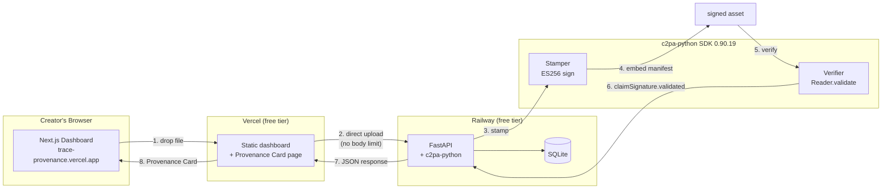

# Trace — The Provenance-First AI Content Engine

> Every AI-generated creator asset, provenance-tagged in one click.
> EU AI Act Article 50 compliant in under one second.

[](https://github.com/sodiq-code/trace/actions/workflows/ci.yml)
[](https://www.python.org/downloads/)
[](LICENSE)

**Live demo:** https://trace-provenance.vercel.app

Trace attaches **cryptographically-verifiable C2PA provenance manifests** to
AI-generated creator assets (images, audio, video) so that creators, sponsors,
and regulators can verify the origin and integrity of any piece of content in
under one second — addressing the EU AI Act Article 50 transparency obligation.

- **Deterministic.** Zero LLM calls in the core path. The C2PA manifest is a
  deterministic library call; the signature is a deterministic crypto operation.
- **Sub-second.** Stamping a typical creator asset takes ~0.5s.
- **Creator-readable.** Every C2PA assertion is rendered in plain English
  ("Generated by Midjourney v7") on the Provenance Card.
- **No file-size limit.** The production backend runs on Railway — uploads up
  to 100 MB+ are supported. Files stamp with real C2PA manifests, not previews.

---

## Live demo

The dashboard is deployed on Vercel with the Python backend on Railway:

| Resource | URL |
| --- | --- |
| **Dashboard** | https://trace-provenance.vercel.app |
| **Backend API** | https://tranquil-bravery-production.up.railway.app |
| **OpenAPI docs** | https://tranquil-bravery-production.up.railway.app/docs |

Upload any AI-generated file (PNG, JPEG, WAV, MP4, MOV — up to 100 MB) and
watch the Provenance Card appear with a green "Cryptographic signature: VALID"
badge and the full source chain.

---

## Quickstart (local)

```bash
git clone https://github.com/sodiq-code/trace.git
cd trace
make setup        # create venv, install deps, install trace in editable mode
make dev          # provision ~/.trace/ + stamp your first asset
```

Then stamp a real asset:

```bash
trace stamp your-thumbnail.png \
  --model midjourney-v7 \
  --prompt "neon tech review thumbnail" \
  --creator maya@channel.com
```

Output:

```
┌──────────────────────────────────────────────────────────────┐
│ Provenance manifest attached  [Valid]                        │
├──────────────────────────────────────────────────────────────┤
│ asset_id:   5b763494-4b90-4608-bded-66153a291fbe             │
│ file_type:  image                                            │
│ sha256:     f6f7fddfc556af9ffabe44d4…                        │
│ card_url:   /card/5b763494-4b90-4608-bded-66153a291fbe       │
│                                                              │
│ Assertions (creator-readable):                               │
│   • Generated using: midjourney-v7                            │
│   • Source type: AI-generated (trained model)                │
│   • Creator: maya@channel.com                                │
│   • Prompt: neon tech review thumbnail                       │
└──────────────────────────────────────────────────────────────┘
```

Verify any stamped asset independently:

```bash
trace verify your-thumbnail__trace_*.png
# → C2PA manifest verified — signature VALID
```

---

## Commands

| Command | Description |
| --- | --- |
| `trace init --email X --channel Y` | Provision `~/.trace/` (signing keys + creator identity) |
| `trace stamp <file> [--model --prompt --creator]` | Attach a C2PA provenance manifest to `<file>` |
| `trace stamp-dir <dir>` | Batch-stamp every supported file in a directory |
| `trace verify <file> [--json]` | Verify a stamped asset's manifest integrity |
| `trace list [--limit N]` | List recently stamped assets |
| `trace serve [--host --port]` | Start the FastAPI HTTP API (Stamper + Verifier + Card) |
| `trace report` | Generate a Monthly Compliance Report PDF |

---

## HTTP API

Start the service with `trace serve` (or `make serve-start` for a detached
background process), then:

| Endpoint | Description |
| --- | --- |
| `POST /v1/stamp` | Stamp an uploaded asset (multipart form: file, model, prompt, creator) |
| `GET /v1/verify/<asset_id>` | JSON: claim chain + signature validity |
| `GET /v1/manifest/<asset_id>` | JSON: raw C2PA manifest + creator-readable assertions |
| `GET /v1/assets` | Recent assets (dashboard list) |
| `GET /v1/stats` | Dashboard stats: total assets, compliance rate, verifications |
| `GET /v1/report` | Monthly Compliance Report (PDF) |
| `GET /card/<asset_id>` | Redirect to the Provenance Card |
| `GET /healthz` | Liveness probe |
| `GET /docs` | Automatic OpenAPI documentation |

---

## Web dashboard

The Next.js dashboard (`web/`) provides a drag-and-drop stamping interface,
compliance charts, and the public Provenance Card page:

```bash
# Terminal 1 — start the FastAPI API
trace serve --port 8000

# Terminal 2 — start the dashboard
cd web && npm install && npm run dev   # http://localhost:3000
```

Open `http://localhost:3000`, drop a file into the dropzone, pick an AI model,
and watch the Provenance Card appear with a green "Cryptographic signature:
VALID" badge.

### Dashboard features

- **Staging area** — dropped files are staged with per-file model selection
  (auto-suggested by file type: image → Midjourney v7, audio → ElevenLabs v3,
  video → Sora 2). Mix image, audio, and video in one batch.
- **Compliance charts** — bar chart of assets by type + donut for compliance
  rate.
- **Asset filter + search** — filter recent assets by type and search by name.
- **CSV export** — download the full asset ledger as a CSV.
- **Monthly Compliance Report** — PDF export with summary stats.
- **Creator profile switcher** — switch between saved creator identities
  (persisted in localStorage).
- **Dark mode** — light / dark / system theme toggle.
- **Manifest inspector** — view the raw C2PA manifest JSON on the Provenance
  Card, with copy-to-clipboard and .json download.
- **Verification history** — timeline of past verification calls.

---

## Architecture



1. **Stamper** wraps [`c2pa-python`](https://github.com/contentauth/c2pa-python)
   (the official C2PA consortium bindings, Rust-backed SDK 0.90.19). It builds
   a C2PA V2 manifest with a `c2pa.actions` assertion
   (`digitalSourceType = trainedAlgorithmicMedia`) plus three Trace-namespaced
   assertions (`std.trace.creator`, `std.trace.model`, `std.trace.prompt`),
   signs it with an ES256 key, and embeds it in the asset.
2. **SQLite** records every stamp (asset hash, manifest, creator, timestamp)
   for the compliance dashboard and the monthly report.
3. **Verifier** reads the embedded manifest back and confirms the claim
   signature is cryptographically intact — the green-path guarantee that every
   stamp ships with `validation_state: Valid`.

The browser uploads directly to the Railway backend, bypassing Vercel's
serverless body-size limit entirely. This architecture matches the blueprint's
deployment target (Python on Railway, Next.js on Vercel, $0/month).

See **[docs/ARCHITECTURE.md](docs/ARCHITECTURE.md)** for the full system
diagram, API contracts, and security model.

---

## Repository structure

```
trace/
├── python/
│   ├── trace/                 # the package (importable as `tracekit`)
│   │   ├── stamper.py         # C2PA stamping (wraps c2pa-python)
│   │   ├── verifier.py        # manifest verification (local + HTTP)
│   │   ├── cli.py             # `trace` command-line entry point
│   │   ├── db.py              # SQLite persistence (4 entities)
│   │   ├── keys.py            # signing-credential provisioning
│   │   ├── config.py          # paths + constants
│   │   ├── schemas.py         # typed data models
│   │   ├── report.py          # Monthly Compliance Report PDF (ReportLab)
│   │   ├── api/               # FastAPI HTTP service (app.py + card template)
│   │   └── credentials/       # bundled default ES256 signing fixtures
│   └── tests/                 # pytest suite (43 tests, 90% coverage)
├── web/                       # Next.js dashboard + Provenance Card
│   ├── src/app/page.tsx       # dashboard (drag-and-drop + compliance stats)
│   ├── src/app/card/[id]/     # Provenance Card page (public URL)
│   ├── src/lib/trace-api.ts   # typed API client (direct-to-backend)
│   ├── src/lib/trace-proxy.ts # shared proxy helper
│   ├── src/components/dashboard/  # charts, staging area, how-it-works, creator switcher
│   └── src/components/ui/      # shadcn/ui components
├── docs/
│   ├── ARCHITECTURE.md
│   ├── DEMO_SCRIPT.md
│   └── DEVPOST_SUBMISSION.md
├── Dockerfile                 # Railway deployment (Python 3.12 + c2pa-python)
├── nixpacks.toml              # fallback builder config
├── railway.toml               # Railway healthcheck + restart policy
├── scripts/
│   ├── setup.sh
│   ├── serve.sh               # start/stop the FastAPI service detached
│   └── demo.sh
├── samples/                   # demo assets (PNG, WAV, SVG)
├── Makefile
├── pyproject.toml
└── .github/workflows/ci.yml
```

> **Why is the package importable as `tracekit` when the directory is `trace/`?**
> Python's standard library already ships a `trace` module; installing a
> top-level package named `trace` would shadow it and break the console-script
> entry point. The source directory stays `python/trace/` but is importable as
> `tracekit` via a `package-dir` mapping in `pyproject.toml`. The CLI command
> is unchanged: `trace`.

---

## Deployment

### Backend (Railway)

The Python backend deploys from the `Dockerfile` at the repo root. Railway
builds the image and runs it with `trace init && trace serve --host 0.0.0.0
--port $PORT`. The healthcheck is `/healthz`.

To deploy your own instance:
1. Fork the repo
2. Create a Railway project, connect the GitHub repo
3. Railway auto-detects the Dockerfile and builds
4. Generate a domain under Settings → Networking

### Dashboard (Vercel)

The Next.js dashboard deploys to Vercel. Set the `NEXT_PUBLIC_TRACE_API_URL`
env var to your Railway backend URL (e.g.
`https://your-service.up.railway.app/v1`) so the browser uploads directly to
the backend, bypassing Vercel's serverless body-size limit.

---

## Development

```bash
make setup       # install
make test        # pytest
make test-cov    # pytest + coverage (target: 80% on Stamper/Verifier)
```

Tests run in complete isolation — every test gets a fresh `TRACE_HOME` under
`tmp_path`, so the developer's real `~/.trace/` is never touched.

---

## Security & compliance

- **Signing keys** are generated/provisioned on `trace init` into `~/.trace/`
  with `0600` permissions and never transmitted.
- **Path traversal** is mitigated via `os.path.basename` on all filenames.
- **Prompt injection** is capped at 2KB; all user-supplied strings are
  HTML-escaped when rendered on the Provenance Card.
- **Supply chain**: `c2pa-python` is pinned to `==0.37.10`; diffs are reviewed
  before any update.
- **CORS**: the backend allows all origins (the verifier is meant to be
  publicly callable).

> **Compliance disclaimer.** Trace generates cryptographically-verifiable C2PA
> manifests that align with EU AI Act Article 50 transparency requirements.
> Trace does not constitute legal advice and does not guarantee regulatory
> compliance in any jurisdiction. Consult a qualified attorney for legal
> compliance questions.

---

## License

MIT — see [LICENSE](LICENSE). The bundled default ES256 signing fixtures are
the upstream c2pa-python test credentials (MIT OR Apache-2.0); replace them
with your own CA-issued credentials for production use.
